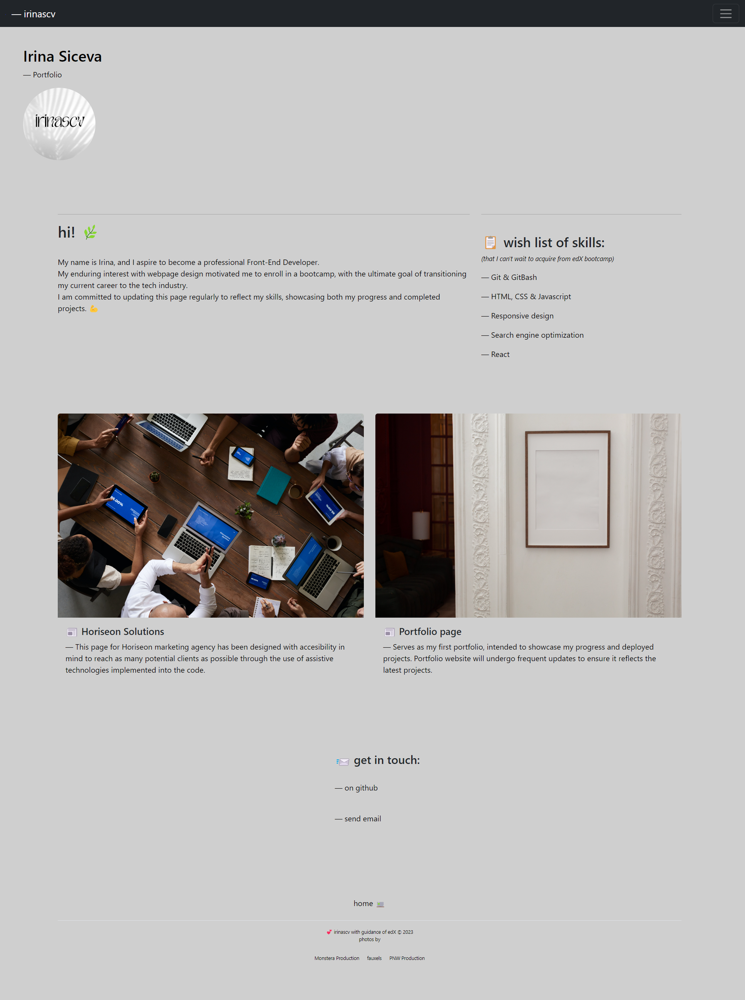

# bootstrap-portfolio

  :hatching_chick:

This page serves as a portfolio, intended to showcase my progress in customizing Bootstrap.

# Installation

**N/A**, unless downloaded from repository and used for experiments with Bootstrap library.

# Usage

Navigate to **irinascv** [bootstrap portfolio](https://irinascv.github.io/bootstrap-portfolio/)  

Click on **navigation** section and review up-to-date projects.

To review used and customized code from Bootstrap library,  
right click and select ***"Inspect"*** :ghost:

# Credits

- **edX** bootcamp Instructor, TA's :stars:
- [Bootstrap Docs Library](https://getbootstrap.com/docs/5.3/layout/grid/) 
- [W3 School](https://www.w3schools.com/bootstrap5/index.php) for Bootstrap features explained
- [She Codes article](https://www.shecodes.io/athena/10619-how-to-center-text-in-bootstrap-columns#:~:text=In%20this%20example%2C%20the%20col,on%20Bootstrap's%20grid%20system%20here.) on customizing Bootstrap grid
- :camera: **pictures all by:**
- [Monstera Production](https://www.pexels.com/photo/empty-white-frame-hanging-on-wall-with-patterns-6373517/) - *from Pexels
- [fauxels](https://www.pexels.com/photo/people-having-business-meeting-together-3183183/) - *from Pexels
- [PNW Production](https://www.pexels.com/photo/a-planner-over-a-white-table-8251148/) - *from Pexels